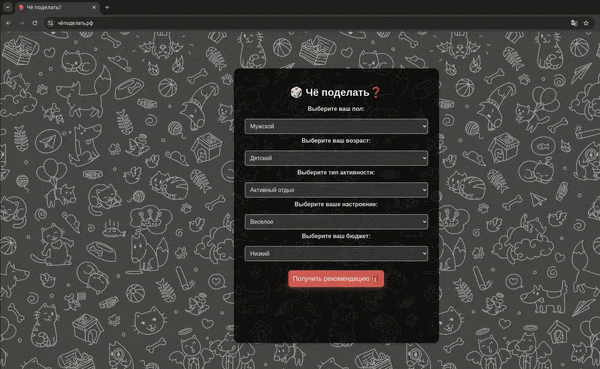

# 🎲 Чё Поделать?

## Описание проекта

**[Чё Поделать?](https://xn--80ahdymf0a7a4c1b.xn--p1ai)** — это веб-приложение, предназначенное для генерации рекомендаций по интересным занятиям в зависимости от настроения, возраста, пола и других параметров пользователя. Это приложение помогает людям находить увлекательные идеи для досуга, будь то активный отдых, творчество или спокойное времяпрепровождение.

### Уникальность и Целевая Аудитория

**Уникальность:**
- **Интерактивность и простота:** Приложение использует простую форму для ввода пользовательских данных и генерирует рекомендации в реальном времени.
- **Адаптивные предложения:** Сервис предлагает идеи, основанные на индивидуальных предпочтениях и текущем настроении пользователя.
- **Лёгкость в использовании:** Минимальные усилия со стороны пользователя для получения полезного результата.

**Целевая Аудитория:**
- Люди, ищущие новые идеи для проведения свободного времени.
- Пользователи, интересующиеся генерацией контента на основе искусственного интеллекта.
- Творческие личности, нуждающиеся в вдохновении для новых занятий.

## Особенности Реализации

### Основные Фишки
- **Использование API OpenAI:** Для генерации уникальных рекомендаций в зависимости от параметров пользователя.
- **Интуитивно понятный интерфейс:** Минимум полей для ввода и мгновенный отклик на запрос.
- **Адаптивный дизайн:** Поддержка мобильных и десктопных устройств.

### Дальнейшие Шаги для Улучшения
1. **Многоязычная поддержка:** Расширение приложения на другие языки.
2. **Интеграция с социальными сетями:** Возможность делиться полученными рекомендациями.
3. **Персонализация на основе истории пользователя:** Учет предыдущих запросов для более точных рекомендаций.
4. **Геймификация:** Добавление уровней и наград для повышения вовлеченности пользователей.

## Необходимые библиотеки и ресурсы для работы

### Основные библиотеки:
- **FastAPI**: Веб-фреймворк для создания API.
- **Uvicorn**: ASGI-сервер для запуска FastAPI.
- **httpx**: Библиотека для асинхронных HTTP-запросов.
- **OpenAI**: Клиент для работы с OpenAI API.
- **Jinja2**: Шаблонизатор для HTML-страниц.

### Ресурсы:
- **OpenAI API Key**: Необходим для взаимодействия с OpenAI.
- **Docker**: Для контейнеризации и развертывания приложения.

## Технические особенности

### Сбор и работа с данными
- **Ввод пользовательских данных:** Данные (пол, возраст, настроение и т.д.) вводятся через HTML-форму и отправляются на сервер с помощью AJAX.
- **Обработка запросов:** Использование FastAPI для обработки запросов и отправки их в OpenAI API.

### Техники промптинга
- **Динамическое создание промптов:** На основе пользовательского ввода генерируется текстовый запрос к модели OpenAI для создания уникальной рекомендации.

### Модели и хранилища
- **Модель:** Используется модель `gpt-3.5-turbo` от OpenAI для генерации текстов.
- **Хранилища:** Данные временно сохраняются в памяти на стороне сервера; можно рассмотреть внедрение более надежного решения для сохранения данных пользователей (например, Redis или PostgreSQL).

## Деплой

### Где развернули приложение
Приложение развернуто с использованием Docker, что обеспечивает его легкость в развертывании и переносимость между различными окружениями. Приложение запущено на сервере с поддержкой Docker, что позволяет легко управлять его жизненным циклом (запуск, остановка, обновление).

### Почему выбрано такое решение?
Docker обеспечивает быструю развертываемость и изоляцию приложения от хост-системы. Это решение подходит для небольших проектов, где важно минимизировать настройку и зависимость от окружения.

### Особенности взаимодействия с пользователем
- **Интерактивный интерфейс:** Пользователь сразу получает обратную связь после отправки запроса (индикатор загрузки и плавный переход к результатам).
- **Минимальные требования:** Для использования достаточно браузера и интернет-соединения.
- **Доступность и простота использования:** Приложение доступно 24/7 и может быть развернуто на любых серверах, поддерживающих Docker.